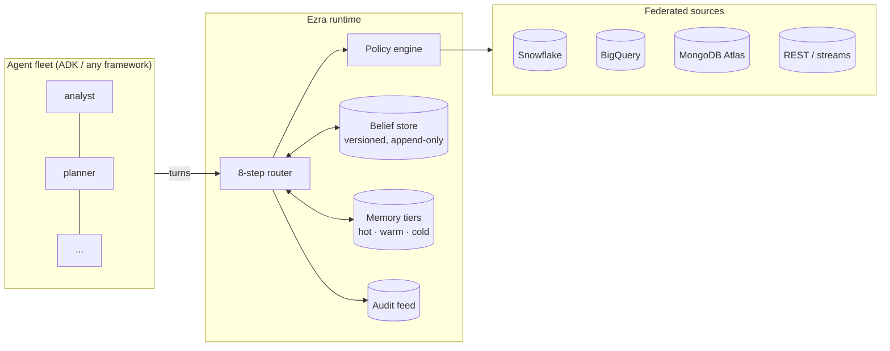

<p align="center">
  <a href="https://ezra128.vercel.app"></a>
</p>

<h3 align="center">Agentic infrastructure for cloud runtimes.</h3>

<p align="center">
  Shared federated memory · versioned beliefs · cross-agent reconciliation · branching replay —<br>
  the state layer your agent fleet is missing.
</p>

<p align="center">
  <a href="https://pypi.org/project/ezra-client/"></a>
  <a href="https://github.com/xavio2495/Ezra/pkgs/container/ezra-api"></a>
  <a href="LICENSE"></a>
  
  
</p>

<p align="center">
  <a href="https://ezra128.vercel.app">Website</a> ·
  <a href="https://ezra128.vercel.app/docs">Docs</a> ·
  <a href="https://ezra128.vercel.app/quickstart">Quick Start</a> ·
  <a href="https://ezra128.vercel.app/pitch">Pitch</a>
</p>

---

## Why Ezra

Frameworks made it easy to build *an* agent. Nobody made it safe to run *fifty*.

The moment you run more than one agent against real enterprise data, you hit four walls at once: agents can't share what they learn, two agents commit contradictory "facts" and nothing notices, every agent queries raw databases with no policy between the model and the data, and when something goes wrong there is no way to answer *what did the agent believe, from what source, at what time?*

**Ezra is the runtime that sits under the fleet and solves exactly that.** It is not another orchestrator or a visual builder — it is the memory, data, belief, and audit plane that any agent framework plugs into.

### Where Ezra sits in the landscape

| | MemGPT / Letta | Langflow | LangGraph / Google ADK | **Ezra** |
|---|---|---|---|---|
| Core job | Memory for an agent | Visual agent builder | Orchestration / control flow | **State infrastructure for agent fleets** |
| Memory | Per-agent, self-editing | Per-flow | Per-graph checkpoints | **Three-tier (Redis / Qdrant / Atlas), shared fleet-wide, permission-scoped per agent** |
| Cross-agent conflicting facts | — | — | — | **Two-pass contradiction detection (embedding → NLI) + 4 reconciliation strategies** |
| Enterprise data access | — | Component plugins | Tool calls | **Federated pushdown to Snowflake / BigQuery / MongoDB / REST with provenance, time-travel, and a policy engine — raw rows never reach the model** |
| Audit & time travel | — | — | — | **Append-only versioned belief log, git-like rewind/revert, branching counterfactual replay** |
| Runs as | Library / server | App | Library / managed | **Cloud runtime: container + Helm chart on Kubernetes (GKE), keyless Workload Identity** |

MemGPT taught agents to manage their own memory. Letta gave one agent a server. Langflow made flows visual. **What MemGPT did for one agent's context window, Ezra does for an entire fleet's shared state.** It complements your orchestrator — there's a first-class [Google ADK toolset](https://ezra128.vercel.app/docs/sdk) — rather than replacing it.

## Install

```bash
# Python SDK (client for a deployed Ezra)
pip install ezra-client

# Run the API anywhere containers run
docker pull ghcr.io/xavio2495/ezra-api:0.1.1

# Production on Kubernetes
helm install ezra oci://ghcr.io/xavio2495/charts/ezra --version 0.1.1

# Or the interactive installer (local dev or full GKE deploy)
curl -fsSL https://ezra128.vercel.app/install.sh | bash
```

## Sixty seconds of Ezra

```python
from ezra_core.runtime import Ezra

ezra = Ezra.from_env()

# A session graph is the fleet's shared world: one belief store,
# one merge strategy, one audit trail.
graph = await ezra.create_session_graph(
    session_graph_id="ops-fleet",
    merge_strategy="highest_trust",
)

# Agents spawn with permission scopes — their memory, data access,
# and beliefs are filtered to these topics at the source.
analyst = await ezra.spawn_agent(graph, agent_id="analyst", permission_scope=["inventory"])
planner = await ezra.spawn_agent(graph, agent_id="planner", permission_scope=["inventory", "logistics"])

# A turn runs Ezra's 8-step router: parse → policy → belief check →
# hydrate scoped memory → federated fetch → assemble → LLM → write-back.
result = await analyst.complete("What changed in inventory this week?")

# Agents coordinate through committed beliefs, not chat. If planner
# commits a claim that contradicts analyst's, Ezra detects it
# (embedding pass → NLI pass) and reconciles it by trust.
await planner.commit("FW-07 stock is short 2 of 4.", "inventory", turn_index=2)

# Every commitment is append-only and replayable.
snapshot = await analyst.replay(turn=1)           # state as-of any turn
branch = await analyst.branch_from(1, "whatif")   # counterfactual fork
```

Against a deployed runtime, the same surface over HTTPS:

```python
from ezra_client import RemoteEzraService

svc = RemoteEzraService(
    "https://your-ezra.example.com",
    session_graph_id="ops-fleet",
    agent_id="analyst",
    permission_scope=["inventory"],
    bearer_token="...",
)
```

## What's inside

- **The 8-step router** — every agent turn passes through parse → policy → belief reconciliation → scoped memory hydration → federated fetch → salience-ranked context assembly → LLM call → write-back. Calibrated overhead: **p50 < 40 ms / p99 < 100 ms** per turn excluding the LLM call, flat from 5 to 100 agents.
- **Three-tier memory** — hot (Redis, recent turns), warm (Qdrant vectors, TTL'd summaries), cold (MongoDB Atlas, durable facts + per-turn archival recall via Atlas Vector Search). Shared across the fleet, scope-filtered per agent, with cross-graph inheritance at spawn.
- **Versioned belief store** — append-only commitments attributed to agent, source, and turn. Two-pass contradiction detection (cosine similarity gate → DeBERTa/Gemini NLI), four reconciliation strategies (`last_write_wins`, `highest_trust`, `manual`, `custom`), and an `@ezra.on_contradiction` hook.
- **Git for agent state** — `rewind` to any turn, `revert` a single commitment (history preserved), `branch_from` + `run_forward` + `diff_branches` for counterfactual replay. Spawn agents *inside* a branch that never existed in the original run.
- **Federated data mesh** — connectors for Snowflake and BigQuery (with `AT TIMESTAMP` / `FOR SYSTEM_TIME AS OF` time travel), MongoDB via MCP, Atlas Stream Processing, and REST. Natural-language intent is translated to validated, allowlisted native queries — the database does the work; the model sees typed summaries with provenance, never raw rows.
- **Policy engine** — permission scopes enforced at the source on every fetch, commit, and recall. A denial is an auditable event, not a silent failure.
- **Audit feed** — one chronological `AuditEvent` stream (`agent_spawned`, `federated_fetch`, `fetch_denied`, `belief_committed`, `contradiction_detected`, `contradiction_reconciled`, `belief_reverted`, `belief_rewound`) behind `GET /ezra/audit`. The live demo dashboard renders purely from this feed.
- **Two meta-agents** — a learning agent (scores and persists durable facts, promotes archival → core, damps trust after reconciliations) and a lifecycle agent (idle-close, archival, warm-tier compaction, belief retention) — both emitting OpenTelemetry spans.
- **Integration surfaces** — Google ADK toolset (`EzraToolset`), a 13-endpoint REST API, the `ezra-client` Python SDK, and OTel traces to any OTLP collector (Arize Phoenix out of the box).

## Architecture



Storage: MongoDB Atlas (cold + beliefs + audit), Qdrant (warm), Redis (hot). LLM via litellm — Gemini through Vertex AI (keyless Workload Identity on GKE) or an API key locally. Python 3.12, FastAPI, Pydantic v2, fully async.

## Run it

```bash
git clone https://github.com/xavio2495/Ezra && cd Ezra
cp .env.example .env            # add your Atlas URI + Gemini key
docker compose up -d redis qdrant
docker compose run --rm app uv run --frozen pytest -q tests/unit   # 274 passed
```

The F1 reference demo (`demo/f1_race_weekend/`) runs a six-agent race-strategy fleet — federated fetches from Snowflake + BigQuery, a permission denial, a genuine cross-agent contradiction reconciled by trust, and a counterfactual branch — entirely offline or live on GKE. The live demo conductor (`demo/conductor/` + `ezra-dashboard/`) streams it to an interactive dashboard over SSE.

## Repository layout

```
ezra_core/           the platform: schemas, tiers, memory, beliefs, mesh, router,
                     runtime, policy, audit, meta-agents, ADK service, REST API
clients/ezra-client/ PyPI SDK (httpx + pydantic only)
demo/                F1 reference fleet + the live demo conductor
ezra-dashboard/      SvelteKit live demo dashboard (SSE, xyflow context graph)
deploy/              Dockerfiles, Terraform, K8s manifests, Helm chart
web/                 ezra128.vercel.app — marketing site + docs
```

<br><br><br>
<div align="center">

<h3>Built By

[Charles](https://github.com/charlesms1246) x [Immanuel](https://github.com/xavio2495)

</h3>
</div>

---
