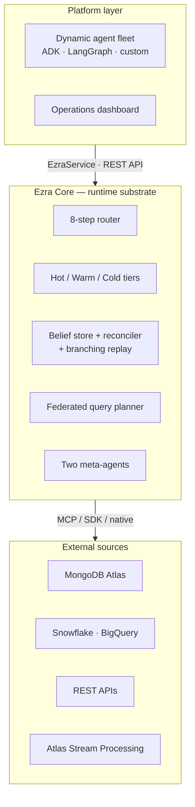

# Architecture

Ezra is two layers: a **platform layer** the agents and operators interact with, and **Ezra Core** — the runtime substrate that handles tiers, memory, beliefs, federation, and replay.

## The dual-layer model

Agents hold an `EzraService` (a scope-bound handle) and talk to the runtime through it. Non-Python or external systems use the [REST API](/docs/rest-api). The runtime itself is framework-agnostic.

## Session graph

A **session graph** binds one root session (an operations period — an incident window, a quarter close, a race weekend) to N concurrent agent contexts. Agents spawn and terminate during its lifetime; **the count is emergent, not designed.**

Each agent has its own _view_ into shared memory and beliefs, filtered by its permission scope. Commitments are scoped to one graph-wide belief store, where the reconciler runs continuously. New graphs can inherit core semantic memory from prior graphs (`inherits_from=[…]`), so institutional memory compounds across operations.

A graph moves through three states: **active** (≥1 agent alive), **closed** (all terminated, recently — hot tier cleared, warm/cold retained), and **archived** (idle past a threshold — episodic/warm compacted, belief history kept verbatim).

## How performance stays flat as N grows

The central claim — adding agents does not slow per-agent decision time — rests on four properties:

1. **Per-agent hot tier is O(1).** Each agent has its own Redis hash. Adding agents adds rows, not iterations.
2. **Warm and cold are shared but filtered.** Qdrant and MongoDB queries filter by `session_graph_id` and permission scope; cost doesn't scale with agent count.
3. **The reconciler is O(active commitments on topic), not O(N).** Only agents that committed on a contested topic enter its working set.
4. **Federated queries are independent.** Each agent's fetch is a separate downstream call; concurrency scales with the source.

The result: constant per-agent latency, linear total throughput. Calibrated target — **p50 < 40 ms / p99 < 100 ms** per-agent router overhead (excluding the LLM call) at 5–100 agents.

## Package boundary

`ezra_core/` is the generic platform. The Formula 1 reference demo lives entirely under `demo/f1_race_weekend/` and is explicitly **not** part of the platform package. The marketing/docs site lives under `web/`.

## Next

- [The 8-Step Router](/docs/router) — the per-agent pipeline.
- [Three-Tier Memory](/docs/memory) — hot / warm / cold.
