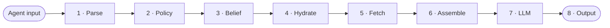

# The 8-Step Router

Every agent turn runs through an eight-step pipeline that assembles the smallest high-signal context and calls the model. Most agent frameworks only do steps 1, 7, and 8 — steps 2–6 are where Ezra differs, doing work other platforms skip or delegate to the model itself.

## 1 · Parse

Intent classification, entity extraction, urgency scoring — done cheaply (a small classifier, no LLM call by default) and used to drive steps 2–5. The `HeuristicIntentParser` is the zero-cost default; an `LLMIntentParser` is available when richer intent is worth a call.

## 2 · Policy

Check the agent's permission scope against the topics and sources this turn would touch. If a `[telemetry, weather]` agent's input reaches for R&D data, the call is **denied here** with a policy trace. Ezra refuses to depend on model behaviour for security — the wrong agent never even fetches data it shouldn't.

## 3 · Belief

Compare new-input claims against the shared belief store using two-pass detection (embedding filter → NLI classifier). Only true contradictions invoke the reconciler, which resolves them _before_ the model is called. See [Beliefs & Reconciliation](/docs/beliefs).

## 4 · Hydrate

At spawn, core semantic memory for the agent's scope is loaded. On **every turn**, archival semantic facts are pulled by _vector similarity_ to the current input (Atlas Vector Search), scope-filtered, alongside warm summaries and recent hot turns. Everything is salience-scored. See [Three-Tier Memory](/docs/memory).

## 5 · Fetch

Does this turn need live external data? The decision is **intent-driven, not application-driven** — Ezra detects when an agent is reaching for current state vs. recalling memory. If a fetch is needed, the connector translates intent into a constrained pushdown query and runs it at the source, returning a typed result with provenance. See [Federated Query](/docs/federation).

## 6 · Assemble

Fill the token budget from highest salience down: pinned beliefs first, then archival facts, warm recalls, hot turns, any mesh result, then the current input — all scope-filtered. Ezra builds the smallest high-signal context that fits, which is why per-agent latency stays flat as fleets scale.

## 7 · LLM

Model-agnostic via litellm. `gemini-3.5-flash` by default (Vertex on GKE). This is the part every framework does the same way.

## 8 · Output & write-back

Record the turn in the hot tier, append commitments to the belief store, and hand off to the asynchronous **learning meta-agent** for fact extraction, write-scoring, archival→core promotion, and trust updates. See [Meta-Agents](/docs/meta-agents).

## What the model actually sees

The assembled prompt, in salience order (highest first):

1. **System prompt** — agent role and permissions
2. **Pinned beliefs** — policy-validated, scope-filtered
3. **Archival facts** — recalled by similarity to this input
4. **Warm summaries** — relevant to this agent's intent
5. **Hot turns** — last N for this agent, salience-ranked
6. **Mesh result** — typed fact with provenance, if a fetch ran
7. **Current agent input**

Each block has a token cost and a salience score; the router fills the budget from the top down. The model always gets the most _relevant_ context that fits — not just the most recent.

Every step is wrapped in an OpenTelemetry span (`router.parse`, `router.policy`, …) exported to Arize Phoenix.
